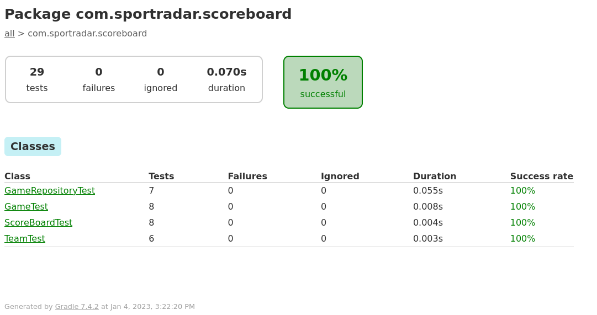
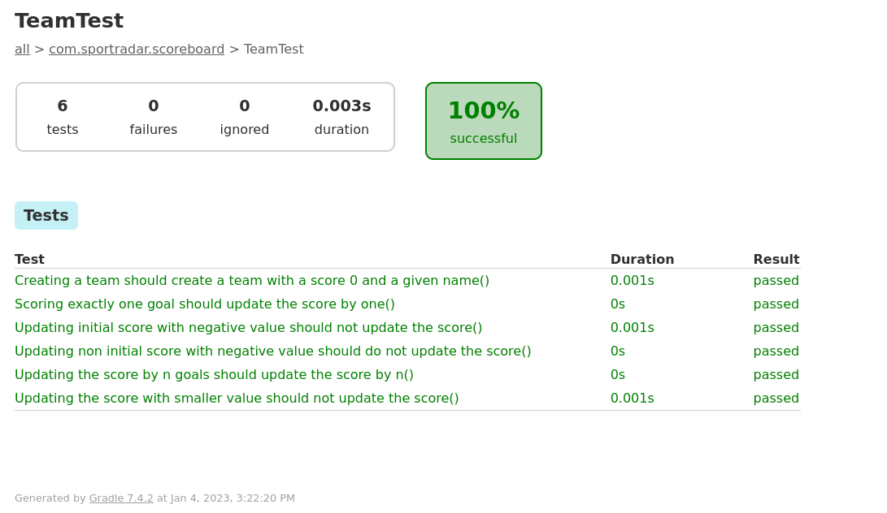
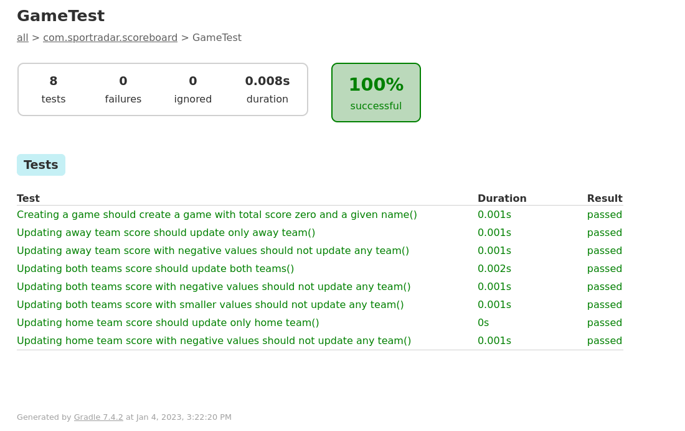
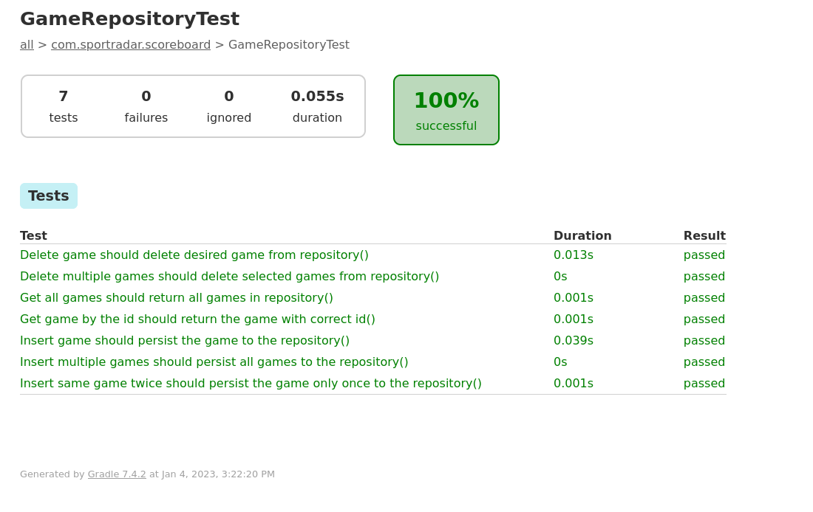
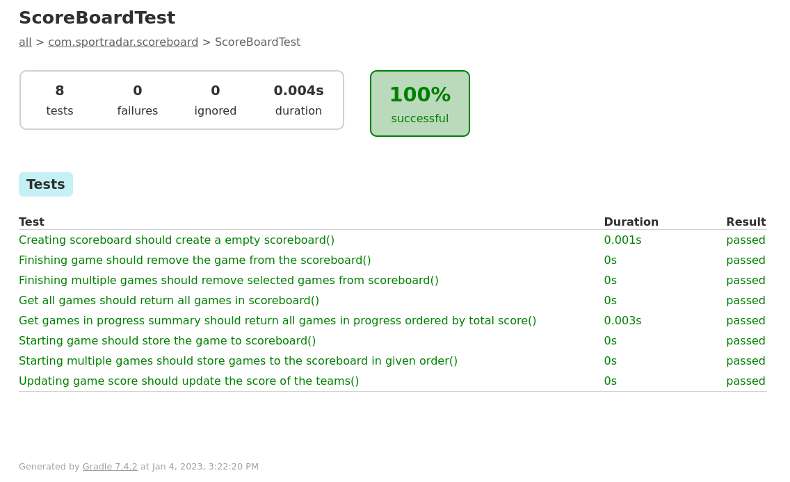

# Live Football World Cup Score Board library 

## Description

This repository contains code for coding exercise from SportRadar.com.

## Instructions

The scoreboard supports the following operations:
1. Start a new game, assuming initial score 0 – 0 and adding it the scoreboard.
   This should capture following parameters:
   a. Home team
   b. Away team
2. Update score. This should receive a pair of absolute scores: home team score and away
   team score.
3. Finish game currently in progress. This removes a match from the scoreboard.
4. Get a summary of games in progress ordered by their total score. The games with the same
   total score will be returned ordered by the most recently started match in the scoreboard.

### Used technologies

* I choose Kotlin as language for making this exercise. I have experience mainly in Java, but lately I started working 
  with Kotlin, and it immediately turned into my language of choice
* Kotlin version 1.8
* JDK version 17
* Gradle project
* JUnit

### Project structure

* `src/main/kotlin` contains code of the library
* `src/test/kotlin` contains all tests for the library

### Project notes

* The library was developed by TDD and OO design in mind
* When creating commit messages, I like to use conventional style messages - it gives me great overview
* For storing the information about games in progress I choose to create external repository class 
  instead of using collection directly in ScoreBoard class. Advantage of this approach is we can replace repository
  class with actual in-memory database using JPA whenever we want.
* I followed MODEL-REPOSITORY-SERVICE file structure, where:
  * `Game` and `Team` are models
  * `GameRepository` is repository
  * `ScoreBoard` is service
* From the start, I tried to implement this library in functional style, as I'm interested in this area, but I do not 
  have enough practical knowledge yet to do so. 
  I'm learning functional programing using Kotlin with Arrow library (https://arrow-kt.io/docs/core/), but I'm at the 
  very beginning of this functional programming journey. Currently, I do not know anything more than theorems about 
  pure functions, higher order functions, side effects and functional style loops using tail-recursion.

### Results

* There is one test function that is covering example provided in coding exercise. It can be found in
  `src/test/kotlin/sportradar/scoreboard/ScoreBoardTest`. It is the last test function.
* Results of tests can be checked in folder test-results. All tests were passed.

    #### Overview of all project tests
    
    #### Overview of tests for Team entity
    
    #### Overview of tests for Game entity
    
    #### Overview of tests for Game entity
    
    #### Overview of tests for Game entity
    
